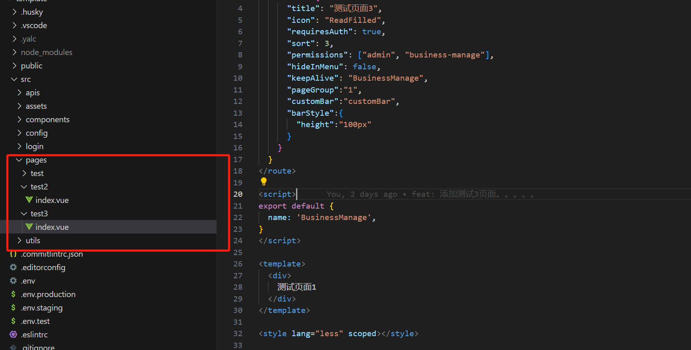

# 路由

### 路由结构说明

路由结构目前分为两部分`预设路由`和`扩展路由`

预设路由：@castle/template-h5中内置的页面路由

扩展路由：业务开发需要扩展的页面路由vite-plugin-pages该插件自动生成，配置参考下文的`拓展路由信息配置`

### 内置路由

##### 登录页

登录页面路由已经内置,页面中的主体内容暴露在生成的模版中，默认路径为 `@/login/index.vue`,配置可在 `project-config.mjs`文件中参考其配置并自定义修改

##### 主页

`@castle/template-h5`中已内置主页页面 并进行页面布局 上部分为页面主题 下部分为tabbar，上文中`vite-plugin-pages`生成的`extraRoute`均为其内嵌子页面，进入主页后的渲染首页由`project-config.mjs`中的 `homePath`进行配置,

##### 403、404页面

`@castle/template-h5`内置404、403页面、详情请咨询`@范晴`

### 扩展路由

##### 页面结构注意事项

与pc端不同，移动端产生的模版无嵌套结构 页面都在pages目录下层文件位置结构如下图



##### 拓展路由信息配置

自动生成路由单个路由页面信息配置如下，路由名称为文件名，参考生成模版中的test页面 如有额外所需配置也可自定义添加

```javascript
<route lang="json">
	{
       "meta": {
          "title": "测试页面2",  // 页面标题
          "icon": "ReadFilled", // 页面icon
          "requiresAuth": true, // 访问是否需要登录
          "sort": 2, // 在tabbar中排序的位置
          "permissions": ["admin", "business-manage"],  // 页面需要的权限
          "hideInMenu": false, // 展示/隐藏tabbar
          "keepAlive": "BusinessManage", // 缓存配置
          "pageGroup":"1" // tabbar中的分组
          "customBar":"customBar", // 嵌入容器中的自定义bar组件
          "barStyle":{  // tabbar内置容器自定义样式
            "height":"100px"
          }
       }
    }
</route>
```

##### 拓展路由信息获取

```js
<script setup>
  import { inject } from 'vue'
  const extraRoutes = inject('extraRoutes')
</script>
```
