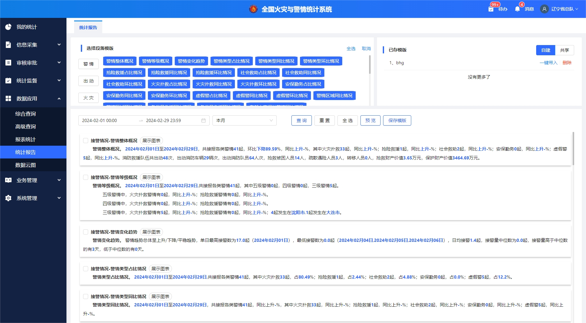
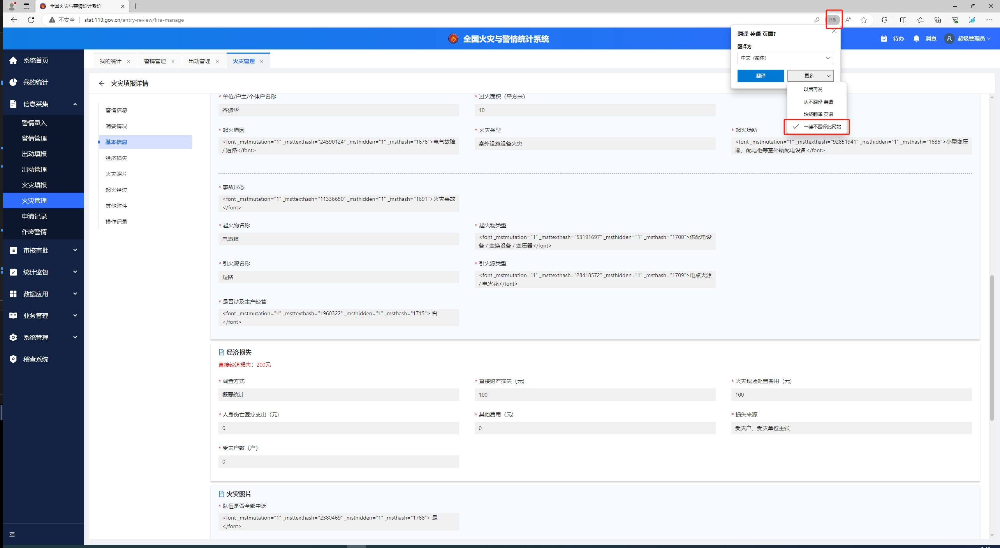

# 全国火灾与统计项目-前端技术问题复盘总结（持续更新中）

## 问题1：[console-for-proxy](https://www.npmjs.com/package/console-for-proxy)

Vue3 之后通过`ref`、`reactive`声明变量，比如以下变量：

```
const detail = ref({ name: '小明' })
const result = reactive({ code: 200 })
```

输出到控制台的变量每次要多点击1-2下，才能看到`name: '小明'`。如下图：


为了减少点击次数我们需要获取到未代理的原始值，问题其实变成了，我们根据代理后的`ref`、`reactive`变量，获取到代理前的值，并输出的控制台。

原生`JS`通过`Reflect`可以获取到代理前的值，不过相对麻烦，而`Vue`本身也提供了[`toRaw`](https://vuejs.org/api/reactivity-advanced.html#toraw)方法，可以通过此方法获取到代理前的值。所以我们封装一下`toRaw`方法并覆盖掉原生`console.log`即可。

火统使用的是封装好的`npm`包，如下：

```
npm i console-for-proxy --save-dev

import 'console-for-proxy'

const detail = ref({ name: '小明' })
const result = reactive({ code: 200 })

console.log(detail, detail.value)
console.log(result)
```

经过改写的`console.log`输出的`ref`、`reactive`如下图：


## 问题2：表单自动滚到未填写的必填项

产品多次提到，减少用户输入、滚动、点击等操作，方便用户使用。对于表单校验未通过，希望滚动到未填写必填项位置

火统采用的是`Dom`查询到所有报红色提示的节点，并滚动到第一个节点位置。

```
export const scrollFormFailed = () => {
  const errorList = document.querySelectorAll('.ant-form-item-has-error')
  errorList[0]?.scrollIntoView({
    block: 'center',
    behavior: 'smooth',
  })
}
```

```
formRef.value.validate().then((values) => {
  if (values) {
    console.log(values)
  }
}).catch(() => {
  message.warning('信息填写不完整，请检查填写内容！')
  scrollFormFailed()
})
```

## 问题3：自定义滚动条

根据产品要求，对于出现滚动的地方自定义滚动条样式。火统里面通过`less`函数来实现自定义及全局滚动条样式统一。（目前火狐滚动条自定义设置跟`Chrome`不一样，未做兼容处理）

```
.scrollBarStyle(@class) {
  .@{class}::-webkit-scrollbar {
    width: 5px;
    height: 5px;
  }
  .@{class}::-webkit-scrollbar-thumb {
    border-radius: 2px;
    background: rgba(0, 0, 0, 0.2);
  }
  .@{class}::-webkit-scrollbar-track {
    border-radius: 0;
    background: rgba(0, 0, 0, 0.06);
  }
}

.scrollBarStyle(item-content);
```

由于[`less`](https://blog.csdn.net/RogerQianpeng/article/details/120780283)函数是高级特性，[`Vite`](https://cn.vitejs.dev/config/shared-options.html#css-preprocessoroptions)配置要做相应更改。

```
// css预处理器
preprocessorOptions: {
  less: {
    additionalData: `@import "${resolve('src/assets/global.less')}";`,
    javascriptEnabled: true,
    strictMath: false,
    math: 'always',
  },
}
```

## 问题4：省市县街道四级懒加载回显

火统使用的是省市县街道4级联动结构，所以做了懒加载优化请求速度。但是在编辑修改的时候，由于市县街道数据未加载，导致回显出现问题。

`浙江省/000000/000000/000000`

主要根据已有的省市县`id`，批量加载出市县街道数据，有了市县街道数据就能正常显示相应中文文案。对于批量加载可以使用[`Promise.all()`](https://developer.mozilla.org/zh-CN/docs/Web/JavaScript/Reference/Global_Objects/Promise/all)，或者使用[`VueUse`](https://vueuse.org/core/useAsyncQueue/)、[`VueHook Plus`](https://inhiblab-core.gitee.io/docs/hooks/useAsyncOrder/)等第三方库封装好的异步任务队列等方法。

```
Promise.all()

VueUse：useAsyncQueue

VueHook Plus：useAsyncOrder
```

## 问题5：[useRerender](http://10.10.3.188:9090/castle/projects/fire-alarm-statistics-ui/blob/dev/src/hooks/useRerender.js)

对于窗口发生变化，或者全屏之后缩放带来的`size`变化，需要重新渲染的地方，可以使用`useRerender`控制。

比如，页面在滚动的过程中，锚点是固定不变的，因为锚点使用的是绝对定位，如果这个时候窗口大小发生了变化，锚点的位置因为是绝对定位就会错乱，所以我们就要重新渲染锚点组件，可以使用`useRerender`。

```
import { useRerender } from '@/hooks/useRerender.js'

const { showCurrentDom } = useRerender()

<div v-if="showCurrentDom"></div>
```

## 问题6：[useModal](http://10.10.3.188:9090/castle/projects/fire-alarm-statistics-ui/blob/dev/src/hooks/useModal.js)

对于弹窗显示隐藏，火统项目中封装了`useModal`，主要因为以下原因。

第一个原因：超过5个弹窗，通过多次定义变量没法很好控制弹窗的显示隐藏，通过封装的`useModal`可以减少定义`ref`、`reactive`变量的次数。

第二个原因：大家遵守相同的规范，减少不同书写风格在版本迭代过程中，逐渐变得冗杂，难以维护。

```
import { useModal } from '@/hooks/useModal.js'

const { show } = useModal()

<Modal v-modal:visible="show.dispatch" />
<Modal v-modal:visible="show.lookFire" />

show.value.dispatch = true
show.value.lookFire = true
```

## 问题7：[useOptions](http://10.10.3.188:9090/castle/projects/fire-alarm-statistics-ui/blob/dev/src/hooks/useOptions.js)

对于字典，火统项目中封装了`useOptions`，主要因为以下原因。

第一个原因：超过5个字典，通过多次定义变量没法很好绑定字典跟控件，通过封装的`useOptions`可以减少定义`ref`、`reactive`变量的次数。

第二个原因：大家遵守相同的规范，减少不同书写方式在版本迭代过程中，逐渐变得冗杂，难以维护。

```
import { useOptions } from '@/hooks/useOptions.js'

const { options } = useOptions({
  editType: [
    {
      label: '重要信息更正',
      value: '1',
    },
    {
      label: '普通信息更正',
      value: '2',
    },
  ],
})

options.value.idNot = [
  {
    label: '是',
    value: '1',
  },
  {
    label: '否',
    value: '2',
  },
]

<Select :options="options.idNot" />
<Select :options="options.editType" />
```

## 问题8：时分秒默认值

火统出动填报中有超过10个时间字段，且多个时间之间存在相互关联。比如：接警时间 < 出动时间 < 到场时间 < 展开时间 < 出水时间 < 控制时间 < 熄灭时间 < 结束时间 < 撤离时间 < 归队时间 < 当前填报时间。产品提出希望在选择 `时分秒` 减少用户滚动。

解决方案：后一个时间的默认时分秒，在前一个选择的时分秒的基础上增加十分钟。（不过产品也未采用此方案，目前方案默认00:00:00）

## 问题9：全局字典管理[useSystemDict](http://10.10.3.188:9090/castle/projects/fire-alarm-statistics-ui/blob/dev/src/store/modules/dict.js)

对于表单需要用到的字典，为了全局统一处理，并且减少每次都请求后端接口，通过[`pinia`](https://pinia.vuejs.org/)做了缓存处理。

```
import { useSystemDict } from '@/store/index.js'

const systemDict = useSystemDict()

systemDict.getSystemDictSync(['JQ_STATUS', 'JQ_TYPE', 'JQ_LEVEL'], null, (res) => {
  options.value.warningStatus = res.JQ_STATUS
  options.value.warningType = res.JQ_TYPE
  options.value.warningLevel = res.JQ_LEVEL
})
```

在需要使用字典的地方，初始化一下`useSystemDict`，通过`getSystemDictSync`方法，传入字典的`key`，就能获取到相应的字典项。

当`getSystemDictSync`方法调用时，会先在缓存中根据`key`查询，如果能查询到字典项直接返回，如果查询不到就请求后端接口（后端会一次返回所有字典项，如果后端是批量获取，原理也一样），请求完成把所有字典项缓存下来，并且根据`key`返回指定的字典项。

## 问题10：多字段表单拆分

火统中出动填报表单有100多个字段，特别长的表单对于用户或者开发者而言都是不太方便的，能分模块分层次展示是最好的，`ant-design-vue`也是支持表单拆分的。

火统是把整个模块分为父子组件，父组件负责表单提交、表单回显、表单模块显示隐藏。子组件负责控件渲染、字段校验、事件监听。如下所示：

```
import { ref } from 'vue'
export const useFormConfig = () => {
  const form = ref({
    baseInfo: {
      name: {
        value: '',
        rules: [
          { requuired: true, message: '请输入姓名' },
        ],
      },
      phone: {
        value: '',
        rules: [
          { required: true, message: '请输入手机号' },
        ],
      },
    },
  })
  return { form }
}
```

```
// 父组件
<script setup>
import { ref, provide } from 'vue'
import { useFormConfig } from './_form-config'

const { form } = useFormConfig()

provide('form', form)
</script>

<template>    
  <a-form :model=form>
    <DraftInfo/>
    <BaseInfo />
    ......    
  </a-form>
</template>
```

```
// 子组件
<script setup>
import { inject } from 'vue'

const form = inject('form')
</script>

<template>
  <a-form-item
    :name="['baseInfo', 'sex', 'value']"
    :rules="form.baseInfo.sex.rules">
    <a-select
      v-model="form.baseInfo.sex.value"
      :options="options.sex"
    />
  </a-form-item>
</template>
```

`Vue3`之后`ref`对象是响应式的，加上`provide`、`inject`之后的`form`对象也保持了响应式，因此把多字段表单拆分成模块是可行的。

## 问题11. [useForm](https://antdv.com/components/form-cn/#API)

火统中出动填报表单有100多个字段，产品提出需要有进度条能展示当前表单填写进度，`ant-design-vue`中可以使用`useForm`动态对表单校验，同时不会触发表单显式红色提示。

`useForm`主要接收两个参数，`modelRef`是根据`form`对象构建出来的需要校验的字段对象，`rulesRef`是跟`modelRef`一一对应的校验规则。

```
useForm(modelRef, rulesRef)
```

```
const modelRef = ref({
  affectedHouse: {
    value: '',
    rules: [{ required: true, message: '请输入' }],
  },
  costSource: {
    value: undefined,
    rules: [{ required: true, message: '请选择' }],
  },
  directDamage: {
    value: [],
    rules: [{ required: true, message: '请输入' }],
  },
  fireInfoOrgList: [
    { name: '小明' },
    { name: '小红' },
  ],
})
```

```
const rulesRef = ref({
  'affectedHouse.value': [{ required: true, message: '请输入' }],
  'costSource.value': [{ required: true, message: '请选择' }],
  'directDamage.value': [{ required: true, message: '请输入' }],
  'fireInfoOrgList[0].name': [{ required: true, message: '请输入' }],
  'fireInfoOrgList[1].name': [{ required: true, message: '请输入' }],
})
```

## 问题12. 数组动态删除

通过`splice`删除数组元素会引起`useForm`报错，`filter`生成新数组不会有此问题。`splice`是对原数组进行处理，而`filter`则是生成新数组后赋值，在对原数组变更过程中已经引起了`Vue`响应式进而触发了`useForm`。

```
form.value.linkUnit.fireDispatchList.splice(index, 1)
```

```
form.value.linkUnit.fireDispatchList = form.value.linkUnit.fireDispatchList.filter(item => item.id !== value)
```

## 问题13. 时间轴


```
第一步：对时间排序，并计算时间差
第二步：计算时间轴宽度，比如选择了`3`个时间则`30%`，`5`个时间则`50%`，选择了全部时间则`100%`
第三步：计算总的时间差，及每个时间差
第四步：根据总的时间差、总的宽度、每个时间差，计算得到每个时间宽度的`px`值
第五步：循环校验每个时间宽度，如果宽度小于`50px`，则设置为`50px`。（此时所有时间宽度之和大于时间轴总宽度）
第六步：循环计算所有最小时间之和，所有最小时间宽度之和
第七步：根据总时间差、总宽度、最小时间之和、最小时间宽度之和，计算的到剩余时间差、剩余时间宽度
第八步：根据剩余时间差、剩余时间宽度、每个时间差，计算得到每个时间宽度（此时所有时间宽度之和小于等于时间轴总宽度）
```

## 问题14. 移动端`ProModal`

移动端正常页面传参为`router`或者`Vuex`等方式，而`PC` `Castle` `ProModal`传参为`props`，为了保持两端一致，方便维护，所以移动端特殊页面也采用了全屏展示的`ProModal`。

问题是移动端可以侧滑关闭页面，如果是在列表上显示`ProModal`，则侧滑关闭会出现同时关闭`ProModal`和列表页面。

解决方案：

```
const route = useRoute();

const router = useRouter();

const currentTime = dayjs().valueOf();

const showModal = ref(false);

watch(() => props.visible, (newValue) => {
  if (newValue) {
    router.push({
      path: route.path,
      query: {
        temporary: currentTime,
      }
    })
  }
  showModal.value = newValue;
});
```

```
const closeModal = () => {
  router.go(-1);
  showModal.value = false;
  emit("update:visible", showModal.value);
};
```

```
watch(() => [route.path], () => {
  if ((!route.query?.temporary || Number(route.query?.temporary) < currentTime)) {
    showModal.value = false;
    emit('update:visible', showModal.value);
  }
}, { immediate: true, deep: true })
```

## 问题15. `a-typography-text`导致页面卡顿



```
<template v-for="(item, index) in templateContent" :key="index">
  <a-typography-text v-if="item === 'X'" type="primary">
    {{ num (index) }}
  </a-typography-text>
  <a-typography-text v-else-if="item">
    {{ item }}
  </a-typography-text>
</template>
```
优化后
```
<template v-for="(item, index) in templateContent" :key="index">
  <span v-if="item === 'X'" class="typography-text-primary">
    {{ num (index) }}
  </span>
  <template v-else-if="item">
    {{ item }}
  </template>
</template>
```

## 问题16. Chrome 121 版本自定义滚动条不生效（问题`3`补充）

`scrollbar-color`会使`webkit-scrollbar`无效。

```
.top-row {
  // scrollbar-color: rgba(0, 0, 0, 0.2) rgba(0, 0, 0, 0.06);
}
.top-row::-webkit-scrollbar {
  width: 5px;
  height: 5px;
}
.top-row::-webkit-scrollbar-thumb {
  border-radius: 2px;
  background: rgba(0, 0, 0, 0.2);
}
.top-row::-webkit-scrollbar-track {
  border-radius: 0;
  background: rgba(0, 0, 0, 0.06);
}
```

## 问题17. 虚拟滚动

区域管理模块，默认是`Tree`结构，搜索之后变成了`List`结构。因为要显示表头，故使用`Ant-design-vue` `Table`组件的`Child`属性实现，但是会出现搜索后，当数据量超过`1000`会很卡顿。

`Ant-design-vue`3.x或者4.x不支持虚拟滚动。`VueUse`中[`useVirtualList`](https://vueuse.org/core/useVirtualList/)或者参考[`vue-virtual-scroller`](https://github.com/Akryum/vue-virtual-scroller)

火统目前处理方式：默认展示`100`条数据，当滚动到底部，再加载`100`条，[如此反复](http://10.10.3.188:9090/castle/projects/fire-alarm-statistics-ui/-/blob/master/src/components/pro-list/index.vue)。

## 问题18. 时间戳毫秒问题

1. 比如时间戳`1707026261925`存在后端会变成`1707026261000`或者`1707026262000`，后端如果类型设置为`long`，会出现四舍五入。可以使用`unix`取代`valueOf`，或者后端存为字符串

2. 当时间戳进行计算时，比如`1707026261125 - 1707026260725 = 400`，页面上看到的相差`1s`，`diff`得到的是`400`毫秒约等于后是`0s`。对于涉及到时间差计算的，使用`unix`取代`valueOf`，或者监听`change`，使用`set`，动态设置`hour`、`minute`、`second`

3. 类似当两个时间进行比较时，因为毫秒的存在，会出现`A000 === B000`，`A222 > B111`，`A111 < B222`

## 问题19. 表单字段联动，数据置空

第一次提交表单，数据为`A:value1`、`B:value`，第二次提交表单，数据为`A:value2`、`C:value`。

当`A`变动的时候，需要把`B`置空（不同类型为''或者`undefined`），后端也需要处理，大部分情况后端不会对空值数据库执行`update`。

如果不处理，再次编辑表单会出现`B:value`有值，或者统计数据的时候，能查到该条数据，但是详情并没有该字段。

## 问题20. `input`表单历史记录不显示

```
<a-form autocomplete="off">
</a-form>
```

`edge`浏览器需要单独设置[`aria-autocomplete`](https://blog.csdn.net/weixin_43824054/article/details/130493653)属性。

```
<a-form>
  <a-input aria-autocomplete="none" />
</a-form>
```

## 问题21. `edge`浏览器翻译插件导致阅读态`多级组件`显示乱码



处理办法把`index.html`中`<html lang="en">` 属性改为`<html lang="zh">`，或者在`index.html`增加

```
<html lang="en" translate="no">

<meta name="google" content="notranslate">
```

多级组件`a-cascader`如果设置`max-tag-count="responsive"`属性，此时阅读态组件不会显示省略号后面的内容，要特殊处理。
