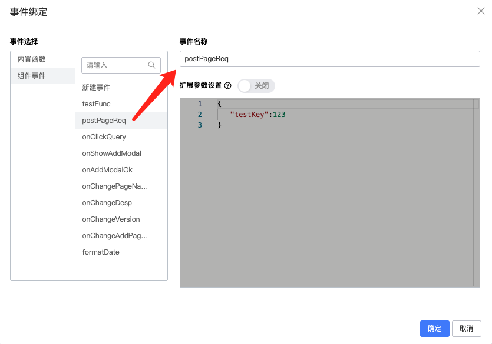

<a name="RXdCC"></a>
# 概要介绍
Castle低代码引擎是基于阿里低代码搭建协议，集成自有物料库的vue定制实现。
<br />整个引擎现已达成「**低代码页面创建**」--> 「**低代码页面编辑预览**」--> 「**低代码页面发布**」--> 「**项目中低代码页面组件集成**」的业务闭环

<a name="Eobq9"></a>
# 功能介绍
<a name="ZRq1r"></a>
## 1. 创建页面
在Castle前端中台的「低代码搭建」菜单页，点击「+ 新增」，在弹窗中输入页面名<br />地址：[http://castle-platform.cp.hxdi.cn/lowcode](http://castle-platform.cp.hxdi.cn/lowcode)


<a name="RQHct"></a>
## 2. 搭建页面
搭建页面集成了「组件库」「组件属性面板」「请求数据源」「组件js面板」「保存、预览、发布」等功能，分别概览如下


<a name="te4St"></a>
### 2.1. 组件库
组件库中已集成一系列自有「组件物料」，支持搜索组件名，从中拖拽组件进入画布即可


<a name="Ey9t2"></a>
### 2.2. 组件属性面板
该面板中可以编辑组件的属性、css、绑定事件、高级功能
<a name="aRPr1"></a>
#### 2.2.1. 属性

1. 鼠标悬浮「属性中文名」可以查看对应的「属性变量名」


2. 右侧 {/} 按钮可以将「变量」作为属性值，支持用vue2语法获取data变量，例如：this.xxxx


3. 新增表格dataIndex通过string绑定


4. 表格自定义渲染，支持antdv的customRender函数及入参


<a name="dFLVc"></a>
#### 2.2.2. 样式
「样式」面板支持业务开发中的绝大多数css配置，如果不满足还可以通过自定义「css源码编辑」


<a name="Rbopx"></a>
#### 2.2.3. 事件
「事件」面板用于绑定组件的事件触发函数

 

组件事件支持绑定「新建事件」和「已有事件」↓↓↓
<a name="nijRx"></a>
##### 2.2.3.1. 新建事件
流程如下，点击「确定」后，会自动在「源码面板」创建事件函数


<a name="oN7jh"></a>
##### 2.2.3.2. 已有事件


<a name="BYZ8y"></a>
### 2.3. 请求
低代码引擎的请求发起支持两种方式:「请求数据源」配置、「js发起fetch请求」
<a name="r8MUv"></a>
#### 2.3.1. 请求数据源
数据源通过「新建」->「fetch」创建，根据请求需要，输入相应配置


1. **「是否自动请求」**表示是否在页面**mounted**之后，直接发起请求
2. 对于**GET请求**，**需要**在「添加数据处理函数」中添加 **「请求前对参数的处理函数」**
```javascript
function (options) {
  options.credentials = 'omit'
  return options;
}
```

1. 那么配置请求后，如何在「js面板」调用请求呢？-> 在你需要调用请求的地方，参考如下方法调用请求


```javascript
this.dataSourceMap['pageList'].load({
  pageName: this.queryForm.pageName,
  version: this.queryForm.version,
  description: this.queryForm.description,
}).then(res => { 
  if (res.data) {
    this.tableData = res.data
  }
}).catch(error => { 
  LowcodeMaterialAntVue.message.error(error)
});
```
> **注意**：编辑js后，记得要点击源码面板右上角的 **「保存」**，否则改动会丢失！
>
> 


<a name="cMAWx"></a>
#### 2.3.2. js发起fetch请求
在源码面板中用fetch请求


```javascript
async postReq(data) {
  const options = {
    method: 'POST',
    headers: {
      'Content-Type': 'application/json' // 根据实际情况设置请求头
    },
    body: JSON.stringify(data) // 将数据转换为 JSON 字符串作为请求体
  };

  return fetch('你的URL', options)
    .then(response => response.json())
    .then(res => {
      ...
    })
},
```
<a name="YTclU"></a>
### 2.4. 保存、预览、发布
<a name="pkCAt"></a>
#### 2.4.1. 保存
编辑完成页面后，点击「保存」按钮 或者「ctrl+s」快捷键
> 保存后，页面信息会**临时**存储在**localstorage**中，如有重要更新，建议**「发布」**存储至服务器，以免改动丢失

<a name="z6loa"></a>
#### 2.4.2. 预览
在「保存」页面，点击「预览」，查看搭建好的页面
<a name="uC7BP"></a>
#### 2.4.3. 发布
点击「发布」后，弹窗填写「描述」，后会更新主页左上角的「版本」
<a name="BD3Sk"></a>
## 3. 集成页面
页面集成，我们需要给「[lowcode-vue-schema-component](https://www.npmjs.com/package/lowcode-vue-schema-component)」<package-version name="lowcode-vue-schema-component" />
组件提供「**pageName**」页面名、「**version**」版本 ↓↓↓（即下方红框）


<a name="jnQE4"></a>

### 3.1. npm安装组件

```bash
npm install lowcode-vue-schema-component --save
```
<a name="xtwMU"></a>
### 3.2. 注册组件
```javascript
import { createApp } from 'vue';
import App from './App.vue';
import LowcodeVueSchemaComponent from 'lowcode-vue-schema-component';

const app = createApp(App);
app.use(LowcodeVueSchemaComponent); // 注册组件
app.mount('#app');
```
<a name="hGlbC"></a>
### 3.3. 使用组件
```html
<template>
  <Suspense>
    <LowCodePreview :pageName="pageName" :version="version" />
  </Suspense>
</template>

<script setup>
  import { Suspense } from 'vue'
  const pageName = 'page-x'
  const version = '12345678'
</script>

<script>
  export default {
    name: 'App',
    components: {
      Suspense, // 因为LowcodeVueSchemaComponent是异步组件，所以需要使用Suspense包裹
    },
  }
</script>
```


